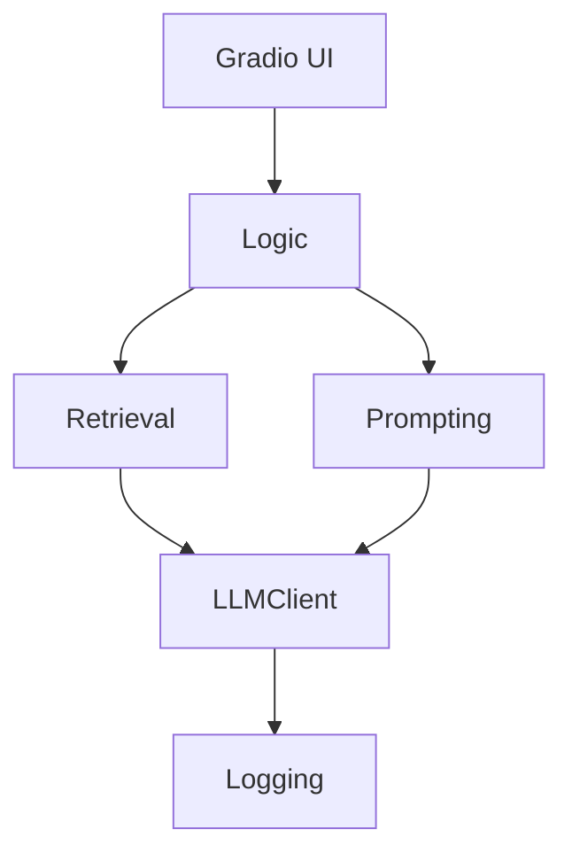
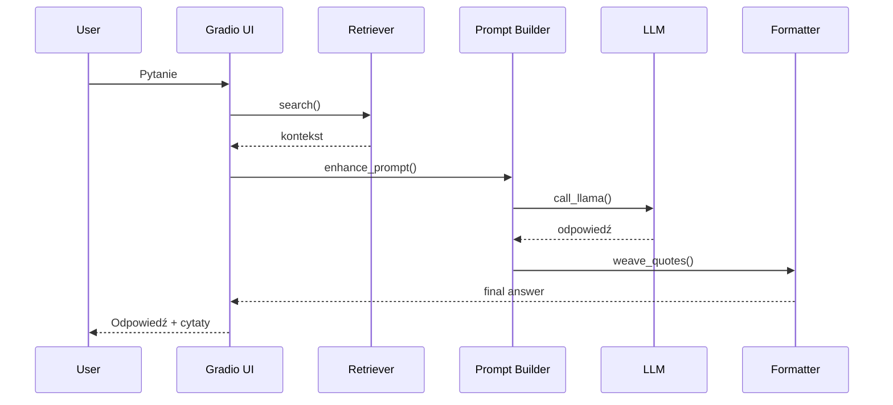

# Repository Report

## Table of Contents
- [1. Inwentaryzacja plików](#1-inwentaryzacja-plików)
- [2. Architektura i przepływy](#2-architektura-i-przepływy)
- [3. Przegląd plików](#3-przegląd-plików)
- [4. Sekcja RAG/LLM](#4-sekcja-ragllm)
- [5. Obserwowalność i wydajność](#5-obserwowalność-i-wydajność)
- [6. Bezpieczeństwo](#6-bezpieczeństwo)
- [7. UX/DX](#7-uxdx)
- [8. Rekomendacje](#8-rekomendacje)

## 1. Inwentaryzacja plików

### Listing
- retrieval_tests/test_queries.json
- README.md
- user_logs/.gitkeep
- metrics_report.md
- data/PODRECZNIK.md
- data/rules.md
- data/FAQ.md
- data/questions.txt
- serialized_index/.gitkeep
- .gitignore
- settings.yaml
- log_tester.py
- requirements.txt
- src/prompt_templates.py
- src/meta_response.py
- src/__init__.py
- src/persona_selector.py
- src/style_prompting.py
- src/llm_client.py
- src/index_loader.py
- src/intent_embedder.py
- src/response_formatter.py
- src/retrieval.py
- src/gradio_ui.py
- src/prompt_enhancer.py
- src/retriever_hybrid.py
- src/retriever_vector.py
- modules/ui/__init__.py
- modules/ui/app.py
- modules/ui/gradio_ui.py
- modules/__init__.py
- modules/prompting/prompt_templates.py
- modules/prompting/meta_response.py
- modules/prompting/__init__.py
- modules/prompting/persona_selector.py
- modules/prompting/style_prompting.py
- modules/prompting/response_formatter.py
- modules/prompting/prompt_enhancer.py
- modules/logic/config.py
- modules/logic/logger_async.py
- modules/logic/debug_mode.py
- modules/logic/metrics_logger.py
- modules/logic/confidence_mode.py
- modules/logic/__init__.py
- modules/logic/fallback_logic.py
- modules/logic/llm_client.py
- modules/logic/utils.py
- modules/logic/index_loader.py
- modules/logic/intent_embedder.py
- modules/logic/query_monitor.py
- modules/parser/__init__.py
- modules/parser/gothic_rag_ui_parser.py
- modules/retrieval/__init__.py
- modules/retrieval/embedder_local.py
- modules/retrieval/retrieval.py
- modules/retrieval/retriever_interface.py
- modules/retrieval/retriever_hybrid.py
- modules/retrieval/retriever_vector.py
- tests/test_retrieval.py
- tests/test_intent_embedder.py
- tests/test_persona_style.py
- tests/test_prompt_enhancer.py
- tests/test_frequent_questions.py
- tests/test_llm_client.py
- tests/test_index_loader.py
- tests/test_prompt_templates.py
- tests/test_meta_response.py
- tests/test_retriever_hybrid.py
- tests/test_response_formatter.py
- stress_test.py
- faiss.py
- frequent_questions.json

### Statystyki rozszerzeń

|Extension|Count|
|---------|-----|
|py|59|
|md|5|
|txt|2|
|json|2|
|gitkeep|2|
|yaml|1|
|gitignore|1|

### Top 10 największych plików

|Size (bytes)|File|
|-----------:|-----|
|1673056|data/PODRECZNIK.md|
|28556|data/FAQ.md|
|14714|modules/parser/gothic_rag_ui_parser.py|
|11692|data/rules.md|
|3832|modules/logic/llm_client.py|
|3720|modules/retrieval/retrieval.py|
|3142|modules/ui/gradio_ui.py|
|2407|modules/retrieval/retriever_vector.py|
|2079|modules/logic/intent_embedder.py|
|1979|modules/logic/metrics_logger.py|

## 2. Architektura i przepływy

### Punkty wejścia
- modules/ui/app.py – aplikacja Gradio
- src/app (uruchamiana jako `python -m src.app` wg README)
- stress_test.py – test obciążeniowy logowania

### Graf zależności (high-level)

## 3. Przegląd plików

|File|Role|API|Deps|Side|LOC|Risk|
|----|----|---|----|----|---|----|
|retrieval_tests/test_queries.json       |                                                                                 |                                                                                                     |                                                                                      |        |10  |              |
|README.md                               |                                                                                 |                                                                                                     |                                                                                      |        |48  |              |
|user_logs/.gitkeep                      |                                                                                 |                                                                                                     |                                                                                      |        |0   |              |
|metrics_report.md                       |                                                                                 |                                                                                                     |                                                                                      |        |9   |              |
|data/PODRECZNIK.md                      |                                                                                 |                                                                                                     |                                                                                      |        |1203|              |
|data/rules.md                           |                                                                                 |                                                                                                     |                                                                                      |        |91  |              |
|data/FAQ.md                             |                                                                                 |                                                                                                     |                                                                                      |        |168 |              |
|data/questions.txt                      |                                                                                 |                                                                                                     |                                                                                      |        |3   |              |
|serialized_index/.gitkeep               |                                                                                 |                                                                                                     |                                                                                      |        |0   |              |
|gitignore                               |                                                                                 |                                                                                                     |                                                                                      |        |3   |              |
|settings.yaml                           |                                                                                 |                                                                                                     |                                                                                      |        |1   |              |
|log_tester.py                           |Verify integrity of log.txt entries after stress testing.                        |check                                                                                                |pathlib, re                                                                           |        |19  |              |
|requirements.txt                        |                                                                                 |                                                                                                     |                                                                                      |        |7   |              |
|src/prompt_templates.py                 |                                                                                 |                                                                                                     |modules                                                                               |        |1   |              |
|src/meta_response.py                    |                                                                                 |                                                                                                     |modules                                                                               |        |1   |              |
|src/__init__.py                         |                                                                                 |                                                                                                     |                                                                                      |        |0   |              |
|src/persona_selector.py                 |                                                                                 |                                                                                                     |modules                                                                               |        |1   |              |
|src/style_prompting.py                  |                                                                                 |                                                                                                     |modules                                                                               |        |1   |              |
|src/llm_client.py                       |                                                                                 |                                                                                                     |modules                                                                               |        |4   |              |
|src/index_loader.py                     |                                                                                 |                                                                                                     |modules                                                                               |        |1   |              |
|src/intent_embedder.py                  |                                                                                 |                                                                                                     |modules                                                                               |        |1   |              |
|src/response_formatter.py               |                                                                                 |                                                                                                     |modules                                                                               |        |1   |              |
|src/retrieval.py                        |                                                                                 |                                                                                                     |modules                                                                               |        |1   |              |
|src/gradio_ui.py                        |                                                                                 |                                                                                                     |modules                                                                               |        |1   |              |
|src/prompt_enhancer.py                  |                                                                                 |                                                                                                     |modules                                                                               |        |1   |              |
|src/retriever_hybrid.py                 |                                                                                 |                                                                                                     |modules                                                                               |        |1   |              |
|src/retriever_vector.py                 |                                                                                 |                                                                                                     |modules                                                                               |        |1   |              |
|modules/ui/__init__.py                  |                                                                                 |                                                                                                     |app, gradio_ui                                                                        |        |3   |              |
|modules/ui/app.py                       |Gradio application for Markdown-based Q&A.                                       |_load_index, _get_index, handle_question                                                             |gradio, modules, pathlib                                                              |        |57  |              |
|modules/ui/gradio_ui.py                 |                                                                                 |_load_index, _get_index, handle_question                                                             |__future__, gradio, json, modules, pathlib                                            |        |97  |              |
|modules/__init__.py                     |High-level package exposing LLM UI components.                                   |                                                                                                     |                                                                                      |        |2   |              |
|modules/prompting/prompt_templates.py   |Prompt templates and few-shot examples for the assistant.                        |                                                                                                     |typing                                                                                |        |25  |              |
|modules/prompting/meta_response.py      |Helpers for meta-level responses such as self-introduction.                      |with_introduction                                                                                    |                                                                                      |        |8   |              |
|modules/prompting/__init__.py           |                                                                                 |                                                                                                     |meta_response, persona_selector, prompt_enhancer, prompt_templates, response_formatter|        |15  |              |
|modules/prompting/persona_selector.py   |Select response style based on persona.                                          |select_persona                                                                                       |                                                                                      |        |11  |              |
|modules/prompting/style_prompting.py    |Apply persona-based style instructions to prompts.                               |apply_style                                                                                          |persona_selector                                                                      |        |8   |              |
|modules/prompting/response_formatter.py |Utilities for formatting model responses.                                        |weave_quotes                                                                                         |typing                                                                                |        |11  |              |
|modules/prompting/prompt_enhancer.py    |Prompt enhancer that injects intent metadata.                                    |enhance_prompt                                                                                       |typing                                                                                |        |21  |              |
|modules/logic/config.py                 |Application configuration constants.                                             |                                                                                                     |os                                                                                    |        |9   |              |
|modules/logic/logger_async.py           |Asynchronous prompt/answer logging using a background thread.                    |AsyncLogger                                                                                          |__future__, atexit, pathlib, queue, threading                                         |file I/O|39  |              |
|modules/logic/debug_mode.py             |Global toggle for debug mode in the UI.                                          |set_debug, is_debug                                                                                  |                                                                                      |        |14  |              |
|modules/logic/metrics_logger.py         |                                                                                 |MetricsRecord, MetricsLogger                                                                         |__future__, dataclasses, json, pathlib, time                                          |file I/O|65  |              |
|modules/logic/confidence_mode.py        |Confidence-based answer gating.                                                  |is_confident                                                                                         |__future__, pathlib, typing, yaml                                                     |file I/O|20  |              |
|modules/logic/__init__.py               |                                                                                 |                                                                                                     |config, debug_mode, intent_embedder, metrics_logger, query_monitor                    |        |19  |              |
|modules/logic/fallback_logic.py         |Fallback behaviours when no relevant citations are found.                        |neutral_fallback, needs_fallback                                                                     |__future__, typing                                                                    |        |14  |              |
|modules/logic/llm_client.py             |LLM client and question answering utilities.                                     |call_llama, format_context, _log                                                                     |confidence_mode, config, fallback_logic, intent_embedder, logger_async                |network |107 |network errors|
|modules/logic/utils.py                  |Utility functions for text normalization and tokenization.                       |normalize, tokenize_for_bm25                                                                         |re, typing, unicodedata                                                               |        |25  |              |
|modules/logic/index_loader.py           |Utilities for serializing and loading BM25 and FAISS indexes.                    |save_bm25, load_bm25, save_faiss                                                                     |__future__, faiss, pickle, typing                                                     |file I/O|29  |              |
|modules/logic/intent_embedder.py        |Intent matching using sentence-transformer embeddings.                           |_DummyModel, parse_intent                                                                            |__future__, numpy, pathlib, typing                                                    |file I/O|55  |              |
|modules/logic/query_monitor.py          |                                                                                 |log_query                                                                                            |__future__, datetime, json, os, pathlib                                               |file I/O|32  |              |
|modules/parser/__init__.py              |                                                                                 |                                                                                                     |gothic_rag_ui_parser                                                                  |        |2   |              |
|modules/parser/gothic_rag_ui_parser.py  |                                                                                 |normalize, md_to_pages, tokenize_for_bm25                                                            |difflib, os, pathlib, re, time                                                        |file I/O|413 |              |
|modules/retrieval/__init__.py           |                                                                                 |                                                                                                     |retrieval, retriever_hybrid, retriever_interface, retriever_vector                    |        |13  |              |
|modules/retrieval/embedder_local.py     |                                                                                 |LocalEmbedder                                                                                        |__future__, collections, typing                                                       |        |29  |              |
|modules/retrieval/retrieval.py          |Markdown processing and BM25 retrieval utilities.                                |md_to_pages, BM25Index                                                                               |logic, re, retriever_interface, typing                                                |        |112 |              |
|modules/retrieval/retriever_interface.py|Common interface for pluggable retrievers.                                       |RetrieverInterface, create_retriever                                                                 |__future__, typing                                                                    |        |32  |              |
|modules/retrieval/retriever_hybrid.py   |Hybrid retriever combining BM25 and vector similarity via reciprocal rank fusion.|HybridRetriever                                                                                      |__future__, retrieval, retriever_interface, retriever_vector, typing                  |        |35  |              |
|modules/retrieval/retriever_vector.py   |Vector-based semantic retriever using SentenceTransformers and FAISS.            |_DummyModel, VectorIndex                                                                             |__future__, faiss, numpy, retriever_interface, typing                                 |        |63  |              |
|tests/test_retrieval.py                 |                                                                                 |test_md_to_pages_splits_file, test_bm25_index_search_returns_results                                 |os, pytest, src, sys                                                                  |file I/O|26  |              |
|tests/test_intent_embedder.py           |                                                                                 |test_parse_intent_walka, test_parse_intent_kradziez                                                  |os, src, sys                                                                          |        |18  |              |
|tests/test_persona_style.py             |                                                                                 |test_select_persona_defaults_to_gracz, test_apply_style_for_mg                                       |os, src, sys                                                                          |        |17  |              |
|tests/test_prompt_enhancer.py           |                                                                                 |test_enhance_prompt_mentions_topic_relevance                                                         |os, src, sys                                                                          |        |16  |              |
|tests/test_frequent_questions.py        |                                                                                 |test_load_frequent_questions                                                                         |src                                                                                   |        |8   |              |
|tests/test_llm_client.py                |                                                                                 |DummyIndex, test_answer_question_reorders_by_intent, test_answer_question_preserves_order_on_low_conf|os, pytest, src, sys                                                                  |        |43  |              |
|tests/test_index_loader.py              |                                                                                 |test_index_serialization                                                                             |faiss, os, src, sys                                                                   |file I/O|32  |              |
|tests/test_prompt_templates.py          |                                                                                 |test_system_prompt_mentions_helper, test_fewshot_nonempty                                            |os, src, sys                                                                          |        |14  |              |
|tests/test_meta_response.py             |                                                                                 |test_with_introduction_adds_prefix                                                                   |os, src, sys                                                                          |        |13  |              |
|tests/test_retriever_hybrid.py          |                                                                                 |pages, vector_index, bm25_index                                                                      |os, pytest, src, sys                                                                  |file I/O|39  |              |
|tests/test_response_formatter.py        |                                                                                 |test_weave_quotes_inserts_inline                                                                     |os, src, sys                                                                          |        |14  |              |
|stress_test.py                          |Concurrency stress test for log.txt writing.                                     |worker, main                                                                                         |pathlib, src, threading                                                               |        |26  |              |
|faiss.py                                |Minimal FAISS stub for testing without external dependency.                      |_BaseIndex, IndexFlatL2, IndexFlatIP                                                                 |__future__, numpy                                                                     |file I/O|52  |              |
|frequent_questions.json                 |                                                                                 |                                                                                                     |                                                                                      |        |7   |              |
## 4. Sekcja RAG/LLM

- **Retriever:** BM25 (rank_bm25) nad pseudo-stronami Markdown; modularne rozszerzenia `retriever_vector.py` (embedding) i `retriever_hybrid.py`.
- **Chunking:** `md_to_pages` dzieli treść na ~1400 znakowe strony.
- **Cache:** brak trwałego cache poza opcjonalnym `serialized_index/`.
- **Prompting:** system prompt w `modules/logic/llm_client.py`; wzmacnianie promptu w `modules/prompting/prompt_enhancer.py` i szablony w `prompt_templates.py`.
- **Styl odpowiedzi:** język polski, cytaty z kontekstu, źródła `[Strona X — Sekcja: Y]`.

### Sekwencja RAG

## 5. Obserwowalność i wydajność

- **Logging:** `logger_async` zapisuje prompt/odpowiedź w tle; brak rotacji logów.
- **Metrics:** `MetricsLogger` mierzy czas startu, pierwszej odpowiedzi i całości (JSONL).
- **Równoległość:** brak wielowątkowości poza asynchronicznym loggerem; stress_test pokazuje jednoczesne zapisy.
- **Start-up:** indeks BM25 ładowany przy pierwszym pytaniu; brak prefetchu.

## 6. Bezpieczeństwo

- Brak twardo zakodowanych sekretów; konfiguracja w `settings.yaml`.
- Wejścia użytkownika minimalnie walidowane (sprawdzenie długości).
- Obsługa błędów LLM: try/except w `call_llama`; brak limitów zapytań.

## 7. UX/DX

- Gradio UI z jednym polem tekstowym i trzema panelami wyników.
- Komunikaty w języku polskim, instrukcja w README.
- Brak szczegółowej dokumentacji API i konfiguracji.

## 8. Rekomendacje

### Quick wins (≤1 dzień)
- [ ] Dodać rotację logów dla `logger_async`.
- [ ] Uzupełnić README o aktualny punkt startowy (`modules/ui/app.py`).
- [ ] Wprowadzić prosty cache indeksu BM25.

### Średnioterminowe (1–2 tyg.)
- [ ] Zaimplementować retriever oparty o wektory (FAISS) i re-ranker.
- [ ] Dodać walidację wejść (filtry niedozwolonych znaków).
- [ ] Przygotować konfigurację `.env` i centralne zarządzanie sekretami.

### Ryzyka
- **P0:** brak dostępności serwera LLM (obecne testy pokazują błąd połączenia).
- **P1:** brak rotacji logów może zapełnić dysk.
- **P2:** niedokładne walidacje mogą przepuszczać złośliwe treści.
